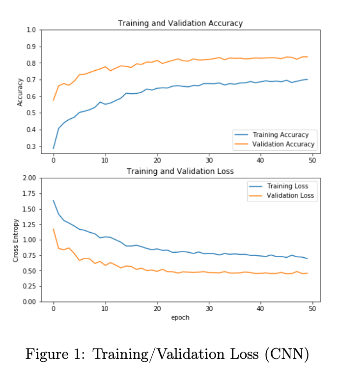
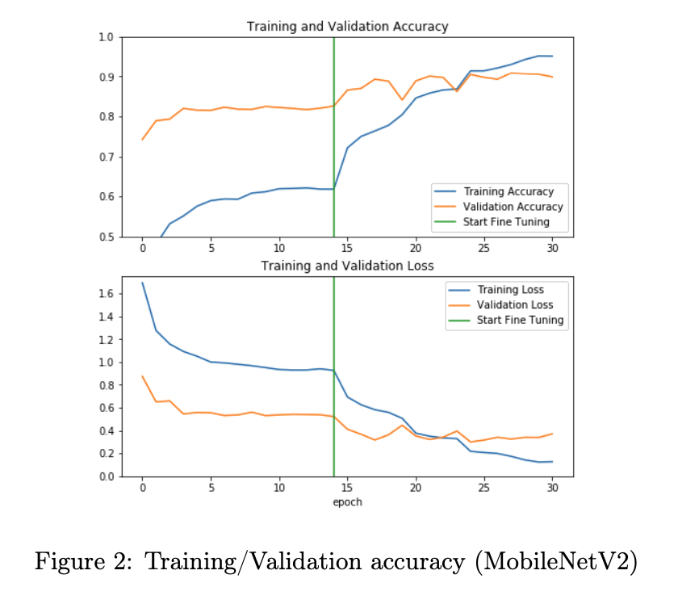
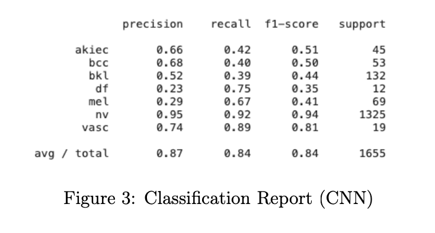
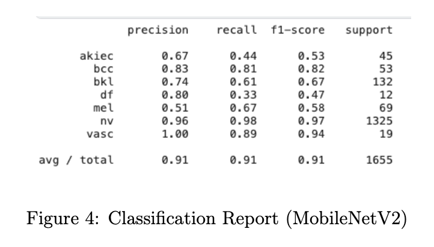

# skin-cancer

Hoang Bao Nghi Bien

## Introduction

Skin cancer, the most prevalent form of cancer in the United States, represents a significant public health challenge. As reported by the Centers for Disease Control and Prevention, this disease encompasses various types, including basal cell carcinoma, squamous cell carcinoma, and melanoma, the deadliest form [1]. Alarmingly, over 9,500 Americans are diagnosed with skin cancer daily, and the disease claims more than two lives every hour [4]. This grim statistic underscores an urgent need for improved diagnostic methods and increased awareness.

In response to this pressing issue, I embarked on a project to harness the potential of deep learning in the early detection of skin cancer. My motivation was driven by the stark realization that early detection is crucial for successful treatment outcomes [2]. The project’s centerpiece is the analysis of the HAM 10,000 dataset [6], a comprehensive collection of dermatoscopy images from the Harvard Dataverse, encompassing a broad spectrum of pigmented skin lesions. This dataset, with its extensive variety and volume, presents an ideal opportunity for applying and testing advanced machine learning techniques.

The primary goal of my project was to develop a deep learning model capable of accurately classifying different types of skin lesions, thereby aiding in the early and precise diagnosis of skin cancer. This endeavor is not just academically significant but also carries immense potential for real-world impact, considering the staggering $8.1 billion annual cost of skin cancer treatment in the U.S. alone [3].

Throughout this report, I will detail the process of building and validating two deep learning models using the HAM 10,000 dataset . The findings of this project not only demonstrate the feasibility of using deep learning for skin cancer diagnosis but also highlight its potential as a valuable tool in the fight against this widespread disease.

This report aims to contribute to the growing body of research in medical image analysis and to propose practical solutions for early skin cancer detection, potentially saving lives and reducing healthcare costs. By sharing these insights, I hope to inspire further research and innovation in this critical area of healthcare.

##  Methods/Case Study
### 1. Dataset

Link dataset: [https://dataverse.harvard.edu/dataset.xhtml?persistentId=doi%3A10. 7910%2FDVN%2FDBW86T](https://dataverse.harvard.edu/dataset.xhtml?persistentId=doi%3A10.7910%2FDVN%2FDBW86T)

In my project focused on the early detection of skin cancer, the initial step involved a detailed exploration of the HAM 10 000 dataset. This dataset, a comprehensive collection of 10,000 dermatoscopic images, was gathered over a period of 20 years from multiple medical institutions. The images represent a range of skin conditions, categorized into 7 distinct types, as shown in Table 1. This diversity in data sources and timespan adds substantial value to the dataset, making it a rich resource for analysis and model training.

|Conditions|Count|
| - | - |
|
Melanocytic Nevi (nv)

 Melanoma (mel)

Benign Keratosis (bkl) 

 Basal Cell Carcinoma (bcc) 

Actinic Keratoses (akiec) 

Vascular Skin Lesions (vasc) 

Dermatofibroma (df)
|
6705 

 1113

 1099

 514 

327 

142 

115 
|

Table 1: Number of Cases for Each Skin Condition

A critical observation from the initial dataset analysis was the pronounced class imbalance, particularly the overwhelming prevalence of Melanocytic Nevi (nv) cases. Imbalances of this nature can potentially impact the performance of machine learning models, leading to biased predictions favoring the majority class. Addressing this imbalance is crucial for ensuring the robustness and generalizability of classification models, as it mitigates the risk of overlooking minority classes, such as Dermatofibroma (df), Vascular skin lesions (vasc), and Actinic Ker- atoses (akiec). To address the pronounced class imbalance inherent in the dataset, a strategic approach involving data augmentation was employed. Data augmentation, as implemented through the utilization of the ImageDataGenerator, played a pivotal role in mitigating the ef- fects of the skewed distribution among skin conditions. The augmentation process involved a comprehensive set of transformations, including rotation (up to 180 degrees), horizontal and vertical shifts (up to 10% of the image dimensions), zooming (up to 10%), and horizontal and vertical flips. By introducing this diversity in the training set, the model was exposed to a more representative spectrum of each class, thereby reducing the risk of biased learning towards the majority class. This augmentation strategy resulted in the generation of approximately 6000 augmented images per class, facilitating a more balanced and robust training regimen for the dermatological classification model. Through this augmentation technique, the model’s ability to generalize across various skin conditions was enhanced, contributing to the overall efficacy and reliability of the classification framework.

To counteract this imbalance, I implemented a data augmentation strategy using the Image- DataGenerator. This approach involved artificially expanding the dataset by applying various transformations to the existing images. These transformations included:

- Rotation up to 180 degrees
- Horizontal and vertical shifts up to 10% of the image dimensions
- Zooming up to 10%
- Horizontal and vertical flips

Data augmentation proved to be a pivotal step in creating a more balanced dataset. By introducing a wide range of variations in the images, the model could learn to recognize and classify skin conditions more robustly, reducing the risk of overfitting to the majority class.

|Conditions|Count|
| - | - |
|
Melanocytic nevi (nv)

 Melanoma (mel)

Benign keratosis (bkl)

 Basal cell carcinoma (bcc)

 Actinic Keratoses (akiec) 

Vascular skin lesions (vasc)

 Dermatofibroma (df)
|
5380 

6020

 5852 

5582 

5690

 4970

4170
|

Table 2: Number of Cases for Each Skin Condition (With Augmented Data)

The augmented dataset was split into training and testing sets, with 70% of the data allocated for training and the remaining 30% for testing. This split is crucial to evaluate the model’s performance on unseen data effectively.

For the training pipeline, specific configurations were set for the ImageDataGenerator. The batch size was chosen as 10 for efficient mini-batch processing, and the images were resized to 224x224 pixels to align with the model’s input requirements. These measures are designed to optimize the learning process and ensure a rigorous evaluation of the model’s performance on the test set.

This exploratory data analysis and preparatory work set the stage for building a deep learning model capable of accurately classifying skin conditions. The steps taken to balance the dataset and configure the training process are integral to developing a model that is not only accurate but also generalizable to various real-world scenarios in dermatological diagnosis.

### 2. Models and Training

In my project on skin cancer detection, I investigated two approaches for model development: building a deep learning model from scratch and using a pre-trained model. The first approach involved designing a new simple convolutional neural network tailored for skin condition clas- sification, while the second utilized an existing model trained on a large dataset, adapted for our specific task. These methods were compared to determine the most effective strategy for accurately classifying skin cancer images.

#### 2.1 CNN

The first model I developed was a custom Convolutional Neural Network (CNN) tailored for dermatological image classification. The architecture of this CNN includes:

- Convolutional Layers: Two sets of convolutional layers, each with 32 and 64 filters of size (3, 3), use ReLU activation and same padding. These layers are essential for feature extraction from the images.
- Max-Pooling Layers: Following each convolutional layer, max-pooling with a pool size of (2, 2) is applied to reduce the spatial dimensions, aiding in abstracting the features.
- Dropout Layers: Implemented with rates of 0.25 and 0.40 after the pooling layers to prevent overfitting by randomly omitting some of the layer outputs during training.
- Flattening Layer: This layer transitions the model from convolutional layers to fully con- nected layers.
- Fully Connected Layers: The network includes a dense layer with 128 units (ReLU acti- vation) followed by a dropout layer for regularization. The final output layer is a dense layer with softmax activation, corresponding to the number of classes in the dataset.

For training, I used the ADAM optimizer with an initial learning rate of 0.0001 and Cate- gorical Cross-entropy as the loss function. Key to the training process were strategic callbacks:

- ModelCheckpoint: To save the model weights when it achieves the best performance in terms of validation accuracy.
- ReduceLROnPlateau: To dynamically adjust the learning rate, aiding the model in achiev- ing finer convergence.

These elements of the model’s architecture and training process were meticulously chosen to optimize its performance for the complex task of classifying dermatological images. The combination of these strategies aimed to ensure efficient convergence and retention of the most effective model weights for accurate classification.

Figure 1: Training/Validation Loss (CNN)

#### 2.2 MobileNetV2

The second model is MobileNetV2 [5], I used transfer learning on this model to compare the performance of a pretrain model versus training from scratch. Since the model is initially trained on ImageNet and the output is 1000, therefore, I created a little modification to serve the purpose of classifying the HAM 10,000 data set. The modification is by incorporating a custom classification head, consisting of a GlobalAveragePooling2D layer followed by a Dense layer with an output size of 7 which is the expected output for this problem. This approach allows for the extraction of meaningful features from the MobileNetV2 backbone while adapting the model to the unique characteristics of the skin condition classification problem.

The training of this model is splitted into 2. Initially, the convolutional base of MobileNetV2 was frozen, leveraging its pre-trained weights for feature extraction. The model was trained for 15 epochs using the same optimizer and callbacks as the custom CNN. After this, I unfroze the layers from the 100th layer onward and conducted an additional 15 epochs of training. This fine- tuning allowed the model to adapt its deeper layers to the specific challenges of dermatological image classification.

The loss, accuracy of the model with and without fine-tune are shown in the figures below:

Figure 2: Training/Validation accuracy (MobileNetV2)

## Results and Discussion

In my comparative analysis of the MobileNetV2-based transfer learning approach and the simpler Convolutional Neural Network (CNN), the MobileNetV2 model demonstrated superior performance. It achieved an impressive accuracy of 91%, exceeding the CNN’s 87%. This 4% increase in accuracy underscores the effectiveness of using a pre-trained model like MobileNetV2 for dermatological image classification. Moreover, the consistent performance across precision, recall, accuracy, and F1 score metrics further substantiates the superiority of the MobileNetV2 model.

Figure 3: Classification Report (CNN)

Figure 4: Classification Report (MobileNetV2)

While the MobileNetV2 model outperformed the custom CNN, there are avenues for further refinement:

- Granular Fine-Tuning: More targeted adjustments to specific layers could enhance the model’s accuracy, especially for complex skin conditions.
- One-vs-All Classification for Melanoma: Focusing specifically on Melanoma may improve the model’s sensitivity and accuracy in identifying this critical condition.
- Adjusting Class Weights: To address data imbalance, altering class weights during train- ing could provide a more equitable learning process, enhancing the model’s capability to recognize minority classes.
- Prevent Overfit for MobileNetV2: Preventing overfitting in a MobileNetV2 model can be achieved by incorporating regularization techniques such as L2 regularization and dropout layers.

These future strategies are aimed at refining the model architecture and training method- ology. The goal is to enhance the model’s discriminative capabilities, making it a more com- prehensive and sensitive tool for dermatological image classification. This ongoing process of improvement and adaptation is crucial in the field of medical image analysis, where accuracy and sensitivity can have significant implications for patient outcomes.

## Conclusion

Reflectingon my journey in developing dermatological image classificationmodels using deep learning, I have accrued insights and skills that have profoundly deepened my understanding and capabilities in this field. My work has led me to develop a comprehensive understanding of frameworks like TensorFlow and Keras. I have improved my skills in deep learning, learning to design custom models and adapt pre-trained models like MobileNetV2 for specific tasks. This experience has also improved my proficiency in data preprocessing, where I learned essential techniques such as image augmentation to tackle class imbalances and enhance the effectiveness of model training.

One of the most transformative aspects of this project was gaining insights into transfer learning, which taught me the utilization of pre-trained networks for feature extraction in spe- cialized domains, like medical image analysis. Implementing advanced optimization techniques such as model checkpoints and dynamic learning rate adjustments has further deepened my understanding of maintaining high performance in deep learning models.

Finally, this project has heightened my awareness of the significant role that AI and deep learning play in healthcare technology, particularly in the early detection and diagnosis of dis- eases. In summary, this project has not only expanded my technical expertise in deep learning but also provided invaluable insights into its practical applications in healthcare, laying a solid foundation for future exploration and innovation in the field.

References

1. Centers for Disease Control and Prevention. What is skin cancer? [https://www.cdc. gov/cancer/skin/basic_info/what-is-skin-cancer.htm ,](https://www.cdc.gov/cancer/skin/basic_info/what-is-skin-cancer.htm) 2023. Accessed on December 5, 2023.
1. Prevent Cancer Foundation. Early cancer detection for better outcomes. [https://www. preventcancer.org/early-cancer-detection-better-outcomes/ ,](https://www.preventcancer.org/early-cancer-detection-better-outcomes/) 2023. Accessed on De- cember 5, 2023.
1. Skin Cancer Foundation. Melanoma facts and statistics. [https://skincancerprevention. org/learning/melanoma-facts-statistics/ ,](https://skincancerprevention.org/learning/melanoma-facts-statistics/) 2023. Accessed on December 5, 2023.
1. American Academy of Dermatology. Skin cancer statistics. [https://www.aad.org/media/ stats-skin-cancer ,](https://www.aad.org/media/stats-skin-cancer) 2023. Accessed on December 5, 2023.
1. Mark Sandler, Andrew Howard, Menglong Zhu, Andrey Zhmoginov, and Liang-Chieh Chen. Mobilenetv2: Inverted residuals and linear bottlenecks. pages 4510–4520, 06 2018.
1. Philipp Tschandl. The HAM10000 dataset, a large collection of multi-source dermatoscopic images of common pigmented skin lesions, 2018.
8
